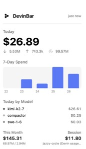
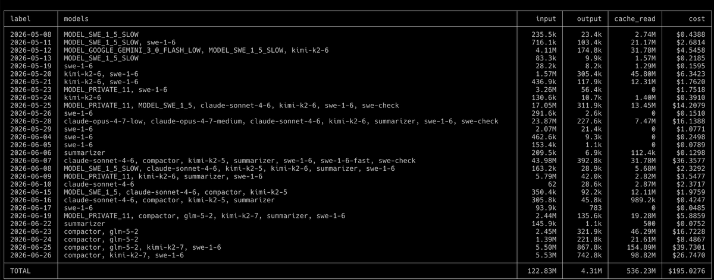

# DevinBar

A macOS menu-bar companion for [Devin CLI](https://cli.devin.ai/) that shows your daily, monthly, and session token usage with cost estimates.





## Features

- **Native SwiftUI menu-bar app** for macOS 14+
- **Today / This Month / Current Session** cost and token breakdown
- **7-day spend chart** to spot usage trends
- **Model breakdown** for today's usage
- **Auto-refresh** every 30 seconds
- **CLI** for terminal reports: `devinusage daily`, `monthly`, `session`
- Reads from your local Devin CLI database (`~/.local/share/devin/cli/sessions.db`)
- No external API keys or network calls

## Requirements

- macOS 14.0 or later
- Devin CLI installed (`~/.local/share/devin/cli/sessions.db` exists)
- Go 1.22+ (for the CLI)
- Swift 5.9+ / Xcode 15+ (for the menu-bar app)

## Installation

### CLI only

```bash
go install github.com/ayu/devinusage/cmd/devinusage@latest
# or
go build -o devinusage ./cmd/devinusage
./devinusage daily
```

### DevinBar menu-bar app

```bash
cd devinbar-swift
./build_app.sh
open ../DevinBar.app
```

## CLI usage

```bash
# Daily report
./devinusage daily

# Monthly report
./devinusage monthly

# Per-session report
./devinusage session

# JSON output for scripting
./devinusage daily --json

# Custom date range
./devinusage daily --since 20260101 --until 20260131
```

## Pricing

Cost estimates use `pricing.json` in the project root. Built-in fallback prices are used if the file is missing.

## License

MIT
